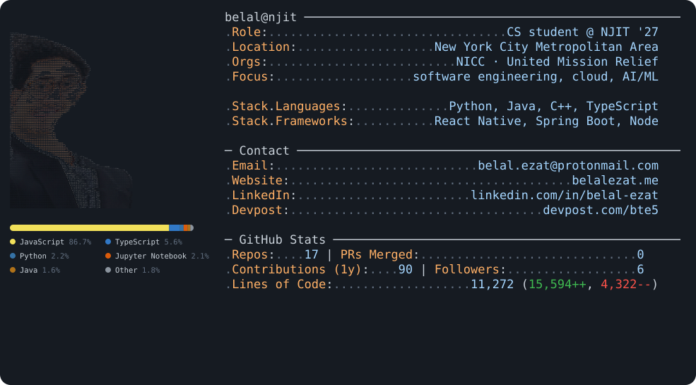

<picture>
  <source media="(prefers-color-scheme: dark)" srcset="dark_mode.svg">
  <source media="(prefers-color-scheme: light)" srcset="light_mode.svg">
  
</picture>

<picture>
  <source media="(prefers-color-scheme: dark)" srcset="https://raw.githubusercontent.com/belalezat1/belalezat1/output/github-snake-dark.svg">
  <source media="(prefers-color-scheme: light)" srcset="https://raw.githubusercontent.com/belalezat1/belalezat1/output/github-snake.svg">
  
</picture>

**Belal Ezat** · CS @ NJIT '27 · New York City Metropolitan Area  
Senior Hacker @ NICC · Treasurer @ United Mission Relief

**Now** · building [Atlas](https://atlasapp.pages.dev) (React Native travel logbook) · seeking **summer '27 SWE internships**  
**Focus** · software engineering, cloud, AI/ML  
**Experience** · Systems Engineer @ Thorlabs · IT Service Specialist @ Best Bet Computer · Administrative Project Manager @ Rock Properties

### Projects
- **[Atlas](https://atlasapp.pages.dev)** — cross-platform travel logbook with multi-tenant Postgres RLS (40+ migrations), Deno Edge Functions, and Cloudflare; traced a 668MB/day egress leak to near-zero repeat-view cost
- **[Relay](https://github.com/belalezat1/Relay)** — Spring Boot workflow orchestration engine with durable Postgres-backed state, dependency resolution, and a REST API (Kafka distribution in progress)
- **Recova** — browser-based PT platform (1st, CBC Hackathon): real-time MediaPipe kinematics, Node.js/RabbitMQ pipeline, Claude clinical feedback
- **[Transparency Lens](https://github.com/belalezat1/Transparency-Lens)** — network-level tracker map with live Socket.IO viz + Gemini explanations (MLH · Best Use of MongoDB Atlas)
- **[Battlesnake 2026](https://github.com/belalezat1/battlesnake2026)** — Flask bot blending heuristics + MCTS under 150ms (2nd place; 76% win rate across 100+ games)
- **ClinicSense** — event-driven MedEd interview scorer (3rd, AWS MedEd Track): Celery/Redis, Transcribe, Comprehend Medical, Bedrock
- **Homelab** — RHEL private cloud with Nextcloud, WireGuard VPN, and Splunk + Wazuh SIEM
- **[Notepad++ search export](https://github.com/notepad-plus-plus/notepad-plus-plus/pull/17219)** — upstream C++/Win32 Find Results export (CSV/JSON/text)

### Skills

### Contact
[email](mailto:belal.ezat@protonmail.com) · [linkedin](https://www.linkedin.com/in/belal-ezat) · [devpost](https://devpost.com/bte5) · [site](https://belalezat.me)
